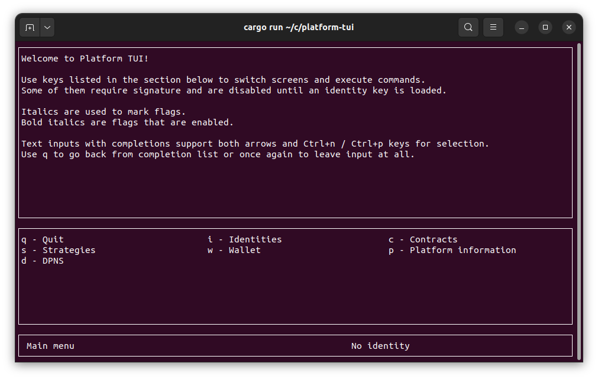
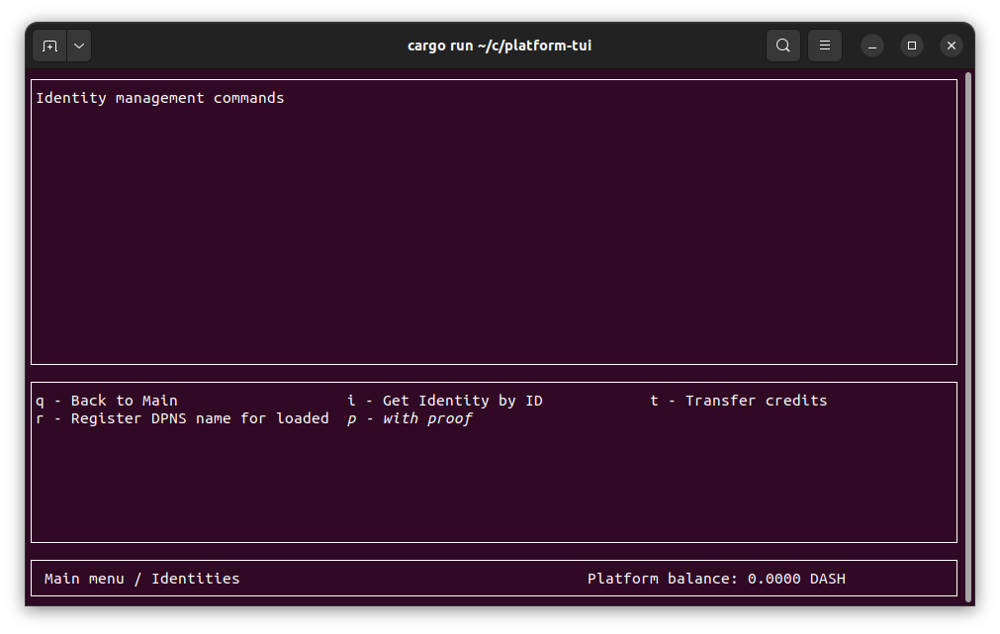
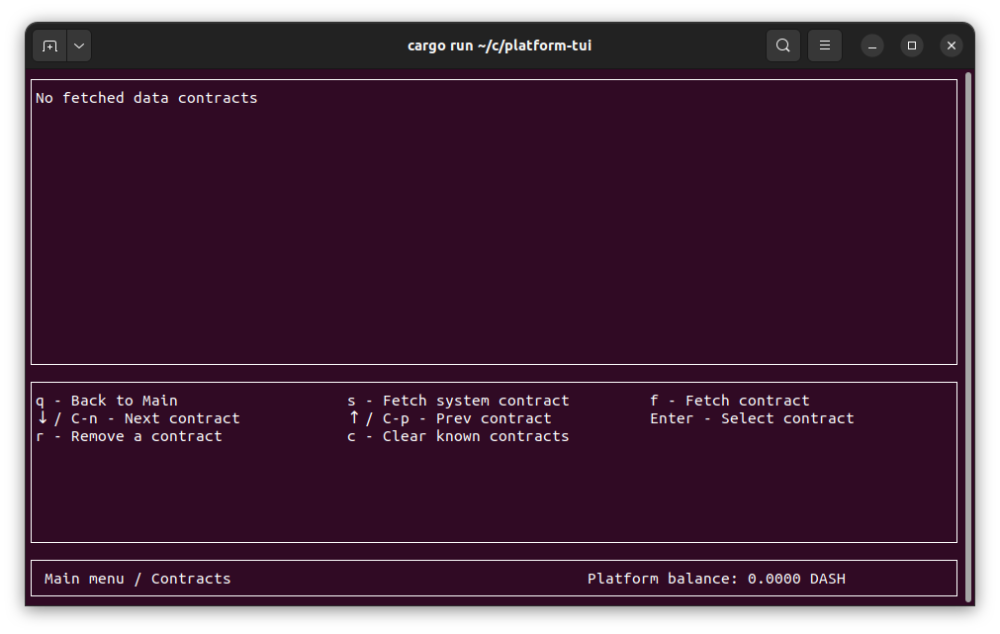
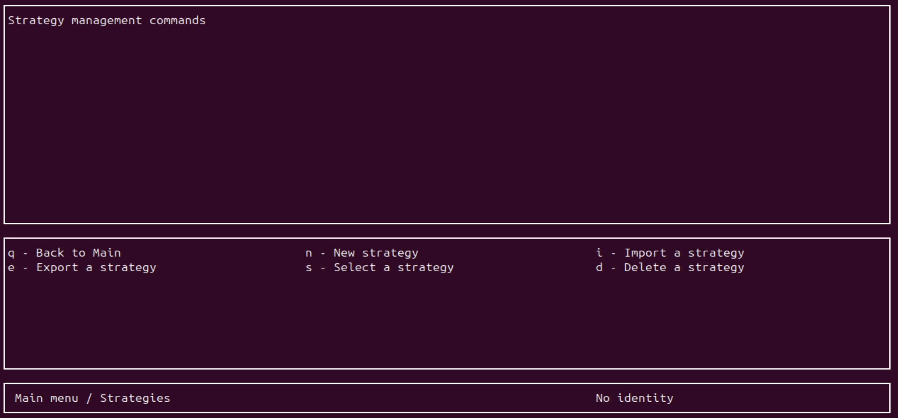
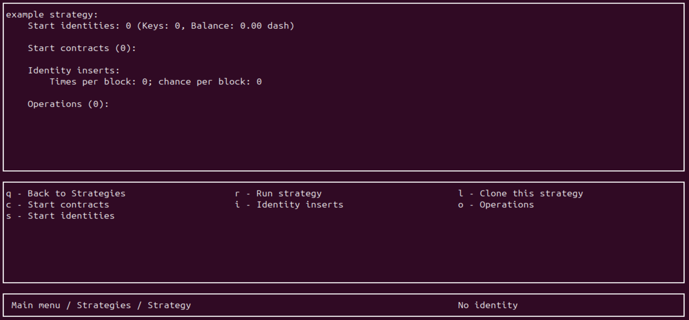
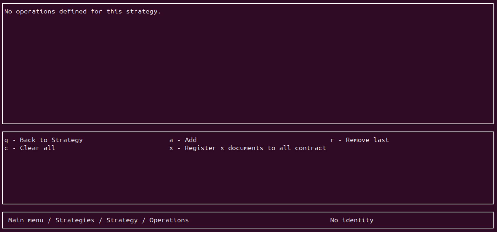
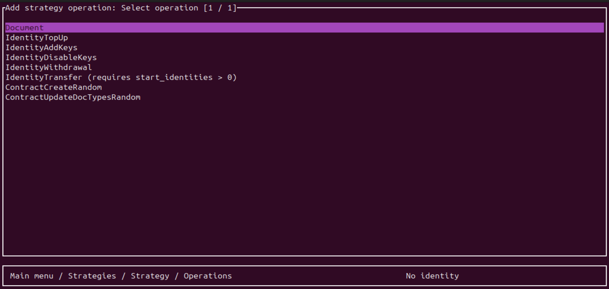
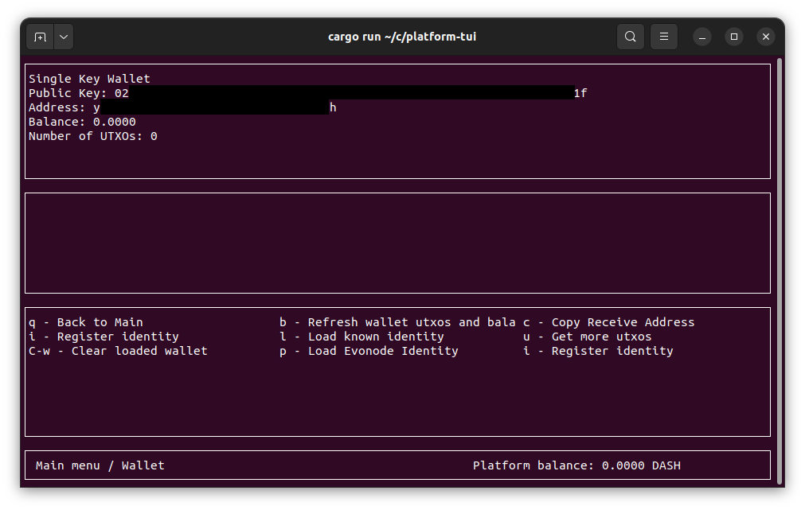
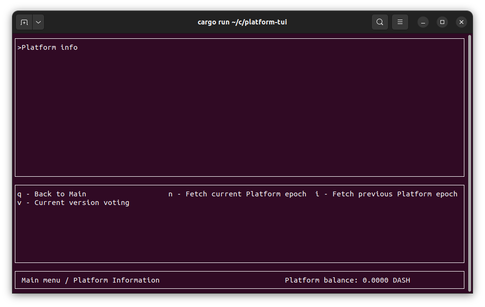

# Platform TUI

- [Main screen](#main-screen)

- [Contracts](#contracts)

- [Strategies](#strategies)

- [Wallet](#wallet)

- [Platform information](#platform-information)

## Main screen

This screen is the application's main menu. The interface provides quick navigation options and a summary of essential information.

## Identity management

This screen is where identity operations are done, including requesting IDs, transfering credits, and registering a [DPNS name](https://docs.dash.org/projects/platform/en/stable/docs/explanations/dpns.html). Press `p` to enable proofs. 

## Contracts

This screen is where you will add, manage and remove [contracts](https://docs.dash.org/projects/platform/en/stable/docs/tutorials/contracts-and-documents.html). System contracts encompass [Dashpay](https://docs.dash.org/projects/platform/en/stable/docs/explanations/dashpay.html) and [DPNS](https://docs.dash.org/projects/platform/en/stable/docs/explanations/dpns.html) contracts as of today, other contracts must be fetched by ID.   

## Strategies

This screen is where you can add, select, import and export [strategies](https://www.dash.org/blog/strategy-tests-usage-guide/). 

### Strategy management

If you select or create a strategy, you are taken to the following screen. Here you can manage the selected strategy.

- "Start contract" is the number of contracts at the start of your strategy
- "start identities" is the number of identity present at the start" - it is recommended to have a sufficient number of identities. See the end of the [strategy guide](https://www.dash.org/blog/strategy-tests-usage-guide/) 
- "identitiy inserts" is the number of identity inserted per block during the runtime of the strategy. 
- "operations" let you define the actions triggered during the runtime of the strategy.

### adding operations to a strategy
If you select "operations", you will be presented with the following screen.

Remember that when adding a number of operations to the strategy, it is the number of operation *per block*. If the strategy runs for 12 blocks, and 5 operations are defined in the strategy, it will total to 5 operations each block for 12 blocks = 60 operations.   

- "add" lets you add specific documents, identity topups, key adds,... a specified number of time per block as shown in the second screenshot below
- "register x documents to all contracts" will register x document each block to every contract that has been created in the strategy so far. Adding 3 documents to 4 contracts will result to 12 documents being added per block. This includes both "start contracts" and contracts added by the "add" option thereabove.   

the "add" screen:

## Wallet

This screen lets you see a loaded wallet's information. You can register and load identities here as well as getting more utxos and loading an evonode identity

## Platform information

This screen lets you see information on the epochs and the current version voting

